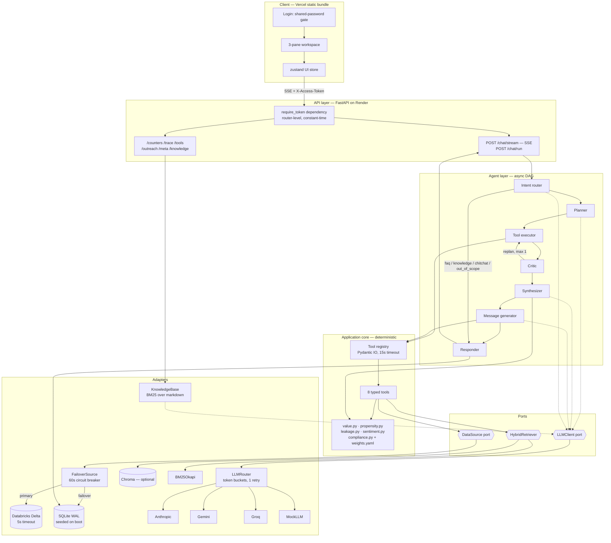
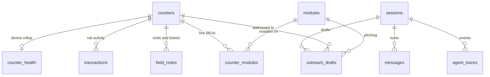
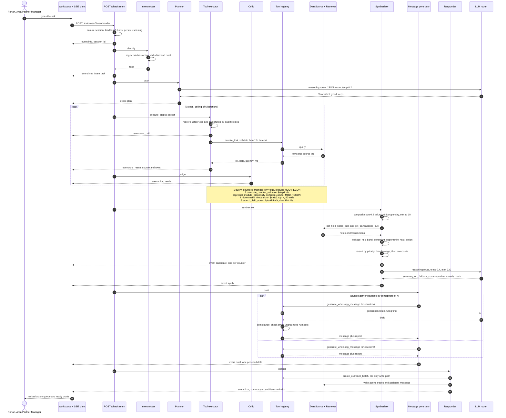

# Counter Copilot — technical design

Design document for the Counter Copilot backend and frontend. Companion to
[`README.md`](../README.md) (the product) and [`execution-flow.md`](execution-flow.md)
(the annotated trace of one run). This document explains *why the code is shaped the way
it is*, and is written to be read alongside the source.

Scope note, stated once and meant: this is a demo-grade build on **synthetic data** — 500
generated counters, ~15,000 generated transactions, `Faker.seed(7)`. No real Billeasy
data was used. All scoring is heuristic. Amounts are in ₹.

Where this document and the README disagree, this document follows the code and says so.

---

## Table of contents

1. [Design goals and constraints](#1-design-goals-and-constraints)
2. [System overview](#2-system-overview)
3. [Component design](#3-component-design)
4. [Data model](#4-data-model)
5. [Scoring design](#5-scoring-design)
6. [Agent execution flow](#6-agent-execution-flow)
7. [LLM routing design](#7-llm-routing-design)
8. [API design](#8-api-design)
9. [Frontend design](#9-frontend-design)
10. [Failure modes and degradation](#10-failure-modes-and-degradation)
11. [Security design](#11-security-design)
12. [Known design debt](#12-known-design-debt)

---

## 1. Design goals and constraints

The product decides which counters an Area Partner Manager should chase today, and drafts
what he says to the supervisor. That is an *accusation-adjacent* workflow over money, so
the constraints are not the usual ones for a chat app.

### 1.1 What this had to optimise for

**Explainability, at the level of a single number.**
Every score a manager sees decomposes into named, weighted feature contributions. The
`ScoreBreakdown` model (`app/domain/models.py`) — `feature`, `value`, `contribution`,
`direction`, `rationale` — is returned by all three scorers, carried on every
`CandidateRecord`, and rendered in the UI. The design line that follows from this: **no
LLM ever computes a number.** The model chooses what to look at and how to phrase it;
arithmetic and ranking are Python over YAML weights. A bad model response is therefore a
bad *plan* — visible in the trace, catchable by the critic — never a confidently wrong
figure.

**Auditability of a whole run.**
The plan is a typed artifact (`Plan`, `PlanStep`), not an emergent ReAct trace. Every node
emits a typed `TraceEvent`; the Responder writes the full archive into `agent_traces` and
`GET /trace/{session_id}` replays it. The plan is inspectable before it executes and
reconstructable after.

**Keyless reviewability.**
With an empty environment the app boots on SQLite, seeds itself deterministically, routes
every LLM call to `MockLLM`, and runs the complete agent. This is a hard requirement, not
a fallback: a reviewer must be able to clone, run one command, and get the canonical demo
with no keys, no warehouse and no vector DB. It is why the mock is a first-class router
tier rather than an error path, and why `_fallback_summary` exists in the synthesizer — a
keyless run must still produce a *specific, data-grounded* answer, not filler.

**Free-tier deployability.**
Render's free web service (512 MB, ephemeral disk, sleeps) and Vercel static hosting.
Consequences that shaped code: no model is loaded in-process; scoring is arithmetic over
dicts; Chroma is optional because it exceeds the memory budget; drafting is bounded by a
semaphore of 4 so free-tier provider rate limits hold; `bootstrap()` reseeds
deterministically on every boot because the filesystem is ephemeral; a self-ping loop
keeps the dyno warm.

**Explainable degradation.**
Every degraded path is *labelled* rather than hidden: `source` on every tool result
(`databricks` / `sqlite(failover)`), `llm_route` on every LLM-produced event,
`fallback_reason` when the router fell to mock, `retriever.mode` (`chroma+bm25` / `bm25`)
on `search_field_notes` output.

### 1.2 What was traded away

| Traded away | For | Consequence |
| --- | --- | --- |
| Learned models | Explainability + no labelled data | Weights are hand-tuned domain judgement, tuned against n=5 hero counters. Honest overfitting risk. |
| Postgres / real OLTP | One-command reviewability + a real failover path to demonstrate | SQLite would not survive production volume. It is a degraded read path, not a scale path. |
| A runtime DAG framework (LangGraph is a dependency but unused at runtime) | Tight control of SSE emission ordering | Control flow is a hand-written `while` loop in `graph.py`; adding a branch means editing that loop. |
| An LLM critic | Latency and token cost on a free tier | The critic is rule-based and catches exactly one failure mode: `query_counters` returning zero rows. |
| Per-request precomputation | Simplicity | Scoring runs in-process on every request; see §12. |
| Multi-tenant auth | Demo scope | Single shared password, no RBAC, no row-level scoping. |
| Dense retrieval by default | Render's memory budget | Deployed default is BM25-only; retrieval quality is visibly weaker. |

---

## 2. System overview

Four layers, with a hexagonal (ports-and-adapters) boundary between the application core
and everything external.

- **API layer** (`app/api/`) — FastAPI routers. Transport only: validate, authenticate,
  drive the agent, serialise SSE. No domain logic.
- **Agent layer** (`app/agent/`) — the orchestration DAG and its nodes. Owns control flow
  and prompts; owns no data access and no arithmetic.
- **Application / domain layer** (`app/application/`, `app/domain/`, `app/scoring/`,
  `app/tools/`) — the deterministic core. Typed tools with Pydantic IO, the three scorers,
  the compliance validator. This layer never imports a concrete adapter.
- **Infrastructure layer** (`app/infrastructure/`, `app/db/`, `app/knowledge_base/`) —
  adapters behind the ports.

### 2.1 The ports

There are two real ports and one de-facto one.

| Port | Definition | Adapters |
| --- | --- | --- |
| `DataSource` | `infrastructure/datasource/base.py` — a `runtime_checkable` Protocol: `find_counters`, `get_counter`, `get_transactions`, `get_modules`, `get_holdings`, `get_field_notes`, `health` | `SQLiteSource`, `DatabricksSource`, `FailoverSource` (a composite adapter implementing the same port) |
| `LLMClient` | `infrastructure/llm/base.py` — a Protocol: `complete`, `embed`, `health` | `AnthropicClient`, `GeminiClient`, `GroqClient`, `MockLLM`, and `LLMRouter` which composes them |
| Retrieval | `HybridRetriever` — a concrete class, not a Protocol | Chroma + BM25, degrading to BM25 |

Both real ports use the same composite trick: the failover/router object *implements the
port it composes*, so callers never branch on which backend is live. Adding the Anthropic
adapter was one file with no change to the router, the nodes, or the calling code — which
was the test of whether the abstraction was real.

Every `DataSource` call returns a `DataSourceResult` wrapper carrying `source`,
`latency_ms`, `rows`, `data`. Provenance is part of the port contract, not an add-on.

**Boundary leak worth naming:** the port returns `dict`s (`Counter(**row).model_dump()`),
not domain objects. Tools and scorers consume raw dicts with `.get()` throughout. That
buys tolerance to schema drift between the SQLite and Delta adapters and costs static
type safety inside the scorers — and it has already caused one real bug (§4.4).

### 2.2 Diagram



---

## 3. Component design

### 3.1 Intent router — `agent/nodes/intent.py`

**Responsibility.** Route the manager's message before any work happens, into one of six
intents: `task | follow_up | knowledge | faq | chitchat | out_of_scope`. Four of the six
short-circuit the whole pipeline — no tools run, no counters are scored, one `synth` event
is emitted and the Responder closes the run.

**Inputs.** `state.manager_query`, `state.history`.
**Outputs.** `state.intent`; an `info` trace event `{node, intent, has_history}`.

**Design.** A regex first pass (`_heuristic`) always runs and always produces an answer;
an LLM classifier can then override it. The precedence inside the heuristic is
deliberate and is the interesting part:

1. greeting → `chitchat`
2. out-of-scope vocabulary → `out_of_scope`
3. a question *about the assistant* → `faq` (so "which modules can you recommend?" does
   not run the pipeline)
4. follow-up prefix with history and no task noun → `follow_up`
5. **action verbs** (`find|identify|draft|rank|…`) → `task`
6. **plural counter nouns** (`counters|outlets|jetties|depots|…`) → `task`
7. payments/compliance vocabulary or a named counter's history → `knowledge`
8. default → `faq` — an unrecognised message is treated as a question, not a counter hunt

Steps 5 and 6 beating step 7 is why *"which outlets crossed the GST threshold?"* is a
pipeline run and *"what is the GST e-invoice threshold?"* is a knowledge lookup. The same
word appears in both; the shape of the ask decides.

The LLM upgrade gate is `any(live for name, live in router.status().items() if name != "mock")`
— checked generically rather than by naming providers. It used to name only Gemini and
Groq, which silently left an Anthropic-only deployment on heuristic routing while Claude
led every other route.

**Failure behaviour.** The LLM classifier is wrapped in a bare `except: pass` — any
failure leaves the heuristic verdict standing. The router can never fail the run. A
returned intent outside `VALID_INTENTS` is discarded.

### 3.2 Planner — `agent/nodes/planner.py`

**Responsibility.** Turn natural language into a typed, executable `Plan`.

**Inputs.** `state.manager_query` (or the rewritten follow-up), `state.history`,
`prompts/planner_system.md` (tool signatures, filter vocabulary, module catalogue,
module-selection heuristics, two few-shot examples).
**Outputs.** `state.plan`; a `plan` trace event with `llm_route` and `latency_ms`.

**Design.** One reasoning call, JSON mode, `temperature=0.2`, `max_tokens=900`. Then
`_coerce_plan` does defensive normalisation, because the failure mode of a planner is a
*plausible* malformed object, not an exception:

- `city_filter` normalised from string | list | null → `list[str] | None`
- `target_module` rejected unless it is one of the eight real ids; otherwise `MOD-RECON`
  (revenue leakage is the daily question and every counter type is eligible for
  reconciliation)
- a step that fails `PlanStep(**s)` is dropped, not raised
- if nothing survives, `_default_plan()` supplies a runnable five-step plan

For `follow_up`, `_rewrite_follow_up` first expands *"now only Kochi, and make it firmer"*
into a standalone task using the last user and assistant turns, emits it as an `info`
event, and plans against that. Its own fallback is string concatenation of the previous
task and the refinement.

**Failure behaviour.** Non-dict response → default plan (logged). Empty `steps` → default
plan preserving the coerced `target_module`. `_rewrite_follow_up` failing → concatenation
fallback. The one path that does dead-end: if the LLM router itself raises
`RuntimeError("All LLM providers failed")`, that propagates out of `run_planner` to the
SSE endpoint, which emits `error` and closes. In practice the mock tier makes that
unreachable.

### 3.3 Tool executor — `agent/nodes/tool_executor.py`

**Responsibility.** Resolve one plan step's arguments against prior results, dispatch it,
record the outcome.

**Inputs.** `state.plan.steps[cursor]`, `state.tool_calls`.
**Outputs.** a `ToolCallRecord` appended to `state.tool_calls`; `tool_call` and
`tool_result` trace events.

**Design.** Three argument transforms run before dispatch:

1. **Placeholder resolution.** `$stepN.ids` and `$stepN.top_k` are looked up against the
   first successful record for step N. `top_k` deliberately returns **40** counters, not
   `AGENT_TOP_K_CANDIDATES`. Capping at 10 here would drop a nano-tier jetty with a severe
   cash-share spike *before propensity is ever computed*; the synthesizer trims to the real
   top-K after scoring.
2. **City backfill.** A plan-level `city_filter` is applied to `query_counters` if the step
   did not carry `cities` itself.
3. **Shortlist backfill.** If `counter_ids` resolves empty for a scoring tool,
   `_latest_counter_ids` walks the tool history backwards for the most recent shortlist
   (limit 80).

Dispatch goes through `invoke_tool` (`application/tool_registry.py`), which is the single
enforcement point for both the planner and a hand-rolled `POST /tools/{name}`:
`model_validate` on the declared input model, then `asyncio.wait_for` at
`AGENT_TOOL_TIMEOUT_SECONDS` (15 s), returning a uniform envelope
`{ok, tool, data, latency_ms, error?}`.

**Failure behaviour.** Nothing raises out of this node. Unknown tool →
`tool_not_found:<name>`. Bad args → `invalid_args: [...]` with the Pydantic error list, and
the handler never runs. Hang → `timeout`. Any other exception → `"<Type>: <message>"`,
logged with a traceback. In every case a `ToolCallRecord` with `ok=False` is appended and
the critic sees it.

### 3.4 Critic — `agent/nodes/critic.py`

**Responsibility.** Judge the most recent tool result, decide pass or replan, advance the
cursor.

**Inputs.** `state.tool_calls[-1]`, `state.plan`, `state.replans`.
**Outputs.** a `critic` trace event `{step, tool, verdict, replan, notes}`; possibly an
`info` event `{action: "replan", new_args}`; `state.cursor` advanced or held.

**Design.** Rule-based, not an LLM call. This removes five LLM round trips from the hot
path in exchange for catching exactly one failure mode well:

- tool envelope `ok=False` → `fail`, `replan=True`
- `query_counters` returned zero rows → `fail`, `replan=True`
- `predict_module_propensity` returned zero rows → note it, but pass

Recovery is blunt and honest: strip `min_tpv`, `min_pending_settlement`, `min_daily_txns`
and `cities` from the step, raise `limit` to 200, pop the failed record so the step re-runs
cleanly, and leave the cursor where it is. Capped at **one replan per session**
(`state.replans < 1`), which is why the loop cannot spin.

**Failure behaviour.** No tool calls yet → returns immediately. A second failure, or a
non-`query_counters` failure, emits the `fail` verdict, does *not* rewrite anything, and
advances the cursor: the run continues with a hole in its evidence rather than aborting.
This is a deliberate choice — a missing `search_field_notes` costs citations, not the
answer.

Note the honest limit: the critic can only replan `query_counters`, because that is the
only tool whose failure it knows how to repair. For every other tool "replan" is a label on
the event, not an action.

### 3.5 Synthesizer — `agent/nodes/synthesizer.py`

**Responsibility.** Merge tool outputs into a ranked `CandidateRecord` list, enrich each
with leakage and sentiment, and write the prose summary. This node does the real ranking
work, and it ranks **twice**.

**Inputs.** the outputs of `query_counters`, `compute_counter_value`,
`predict_module_propensity`, `recommend_modules`, `search_field_notes`; plus bulk field
notes and transactions fetched directly from the `DataSource`.
**Outputs.** `state.candidates`, `state.final_summary`; one `candidate` event per counter
plus one `synth` event.

**Design.**

*First sort — commercial fit.* `composite = w_value·value + w_prop·propensity`, with
**intent-aware weights**: remediation modules (`MOD-RECON`, `MOD-OFFLINE`) fix a live leak,
so urgency beats counter size and propensity dominates at **0.2 / 0.8**; growth modules run
**0.4 / 0.6**. Sort, trim to `AGENT_TOP_K_CANDIDATES` (10).

*Enrichment.* For the surviving ten, two bulk fetches (`get_field_notes_bulk`,
`get_transactions_bulk`), then per counter: sentiment + escalate flag; `leakage_risk`,
`leakage_band`, `leakage_features`; `opportunity_value` = monthly TPV × take rate × 12,
rounded to the nearest ₹1,000 and explicitly a prioritisation aid, never a quote;
`next_action` and `priority`.

*Second sort — the action queue.* `(priority, -leakage_risk, -composite_score)`. This is
what reaches the UI, and it is why the on-screen order is not the composite order. A
counter at `leakage_risk ≥ 0.45` gets *"Call the supervisor within 48h — elevated revenue
leakage"* at priority 1.

The `ranked_ids` source is `prop_map or value_map or counter_map` — propensity preferred,
but a lookup-style query that never scored propensity still surfaces counters instead of
returning nothing.

**Failure behaviour.** Both bulk fetches are individually wrapped: a failure yields an
empty map, so leakage and sentiment degrade to zero/neutral rather than failing the run.
Zero candidates → a plain-language "loosen the criteria" message and **no LLM call at
all** (asking a model to summarise an empty list previously produced a confusing
meta-reply). If the summary call routes to `mock` or returns under 20 characters,
`_fallback_summary` builds a specific, data-grounded summary from the real candidates.

### 3.6 Message generator — `agent/nodes/message_generator.py`

**Responsibility.** Produce one compliance-checked WhatsApp draft per candidate, in
parallel, bounded.

**Inputs.** `state.candidates`, `plan.tone`, `plan.language`, `state.manager_name`.
**Outputs.** `state.drafts`; one `draft` event each, carrying `message`, `compliance`,
`llm_route` and `fallback_reason`.

**Design.** `asyncio.gather` over all candidates behind an `asyncio.Semaphore(4)`. Each
task calls the `generate_whatsapp_message` tool, which routes on the **generation** kind
(Groq first) at `temperature=0.6`, `max_tokens=220`. The prompt receives *only* that
counter's real fields — name, city, counter_type, tier, operator, monthly TPV in ₹, digital
share, pending settlement — the module record, the top three feature contributions with
their rationales, tone, language and the manager's name.

Then `compliance_check` runs (§5.4) and the *redacted* draft is what ships when grounding
fails. The report rides on the event so the drawer can show exactly which figures were
stripped.

**Failure behaviour.** No candidates → an `info` event `no candidates → skipping drafts`
and an early return. A tool envelope with `ok=False` → that candidate's coroutine returns
`None` and is filtered out; the other nine drafts still ship. Counter or module not found
→ the tool returns an empty message with `compliance.error = counter_or_module_not_found`
rather than raising.

### 3.7 Responder — `agent/nodes/responder.py`

**Responsibility.** Persist the run and close the stream. It is the only node that writes.

**Inputs.** `state.archive`, `state.drafts`, `state.candidates`, `state.final_summary`.
**Outputs.** rows in `sessions`, `outreach_drafts`, `agent_traces`, `messages`; the `final`
event.

**Design.** `INSERT OR IGNORE` the session row first, defensively, so the foreign keys on
`outreach_drafts` and `agent_traces` resolve even on paths that reached the Responder
without going through `_ensure_session`. Drafts are persisted through the
`create_outreach_batch` tool — the single write path in the tool set — rather than by
direct SQL, so the write is Pydantic-validated like everything else.

`state.archive` exists precisely because `state.events` is drained incrementally for SSE.
The archive is what makes `GET /trace/{session_id}` a complete replay rather than a tail.

**Failure behaviour.** No exception handling. A DB write failure propagates to the SSE
endpoint, which emits `error`. That is the intended shape: if persistence fails the run is
not auditable, and silently succeeding would be worse. The cost is that the user loses an
answer that was already computed.

### 3.8 Knowledge-base service — `app/knowledge_base/service.py`

**Responsibility.** Answer payments / GST / settlement / counter-history questions from
the reference corpus and from live counter records, grounded.

**Inputs.** a question string. Corpus: three markdown files under `backend/new_features/`
(`payments_compliance.md`, `counter_performance_methodology.md`, `field_ops_faqs.md`),
chunked at `##`/`###` headings. Plus a lazily-built name index over the counter estate.
**Outputs.** `{answer, sources, excerpts, llm_route, latency_ms}`.

**Design.** Two retrieval paths run and are concatenated into one grounding context:

1. **Counter resolution** — `_resolve_counter` first tries an exact-ish match (the
   counter's normalised full name appearing inside the question, longest wins), then falls
   back to voting over *distinctive* name tokens. Distinctiveness is enforced two ways: a
   large `_STOPWORDS` set that includes domain vocabulary (`gate`, `jetty`, `depot`,
   `settlement`, `ncmc`, …), and `_MAX_NAME_TOKEN_FANOUT = 8` — a token shared by more than
   eight counters is dropped as generic. Without this, *"how does NCMC work at an AFC
   gate?"* resolved "gate" to *Kashmere Gate ISBT* and answered a policy question with one
   Delhi counter's pending settlement.
2. **BM25 over document chunks** — `k=3` when a counter resolved, `k=4` otherwise, with
   non-positive scores discarded.

An LLM then answers from that context under a system prompt that forbids inventing
figures. The extractive fallback fires when the route is `None`/`mock` or the answer is
under 15 characters: either the counter's own record rendered as prose, or the top
document chunk truncated at 700 characters. So an answer always comes from documents or
records, never from model memory.

**Failure behaviour.** Missing corpus file → logged and skipped. Name-index build failure →
empty index, document-only answers. LLM failure → extractive fallback with
`llm_route: "documents"`. Nothing matched at all → an honest "not in the knowledge base,
here is what I do cover" reply.

### 3.9 LLM router — `infrastructure/llm/router.py`

Covered in full in §7. Summary of contract: `complete(kind, messages, …)` where `kind` is
`reasoning | generation | embed`; providers are constructed lazily on first use and cached;
`resp.meta["route_used"]` records who answered; `fallback_reason` records why it fell
through. `status()` reports liveness per provider and is what `/status` and `/meta` expose.

### 3.10 Datasource failover — `infrastructure/datasource/failover.py`

**Responsibility.** Present one `DataSource` that prefers Databricks Delta and survives it
being down.

**Inputs.** the same method calls as the port.
**Outputs.** a `DataSourceResult` whose `source` is `databricks` or `sqlite(failover)`.

**Design.** `_call(method, *args)` is generic over the port surface: if the breaker is
closed, try `getattr(primary, method)`; on any exception, log at info, trip the breaker for
60 s, and fall through to the secondary. The failover result is rewritten via
`model_copy(update={"source": f"{secondary.name}(failover)"})` so provenance is explicit
in the trace — a reviewer can see which path served each of the five tool calls.

The breaker matters because a wedged warehouse would otherwise cost 5 s × N tool calls per
run. With it, a dead Databricks costs one slow call per minute.

`FailoverSource` is only constructed when `databricks_enabled` (host, HTTP path and token
all set). Otherwise the factory returns `SQLiteSource` directly, so the default keyless
path has no failover indirection at all.

**Failure behaviour.** Both sides failing raises to the caller — which is a tool, so it
surfaces as an `ok=False` envelope, not a crash. `health()` returns
`primary.health() or secondary.health()`, and falls back to the secondary if the primary's
health check itself raises.

### 3.11 Hybrid retriever — `infrastructure/rag/hybrid_retriever.py`

**Responsibility.** Retrieve cited field-note snippets for grounding, over dense + lexical
indexes.

**Inputs.** all field notes from the `DataSource` at init; a query, `k`, optional
`counter_id` at search time.
**Outputs.** ranked matches with `id` (`FN-<counter_id>-<6 hex>`), `counter_id`, `channel`,
`ts`, `text`, and the three scores (`fused_score`, `bm25`, `dense`).

**Design.** Four stages:

1. **Index.** One chunk per field note. BM25Okapi over alphabetic tokens, always. Chroma
   `PersistentClient` with a cosine HNSW collection, incrementally embedding only ids not
   already present.
2. **Score.** Dense query via Gemini embeddings against Chroma (`n_results ≤ 30`), distance
   converted to similarity as `1/(1+d)`; BM25 scores normalised by the max.
3. **Fuse.** Reciprocal rank fusion at the standard `K=60` over both rankings. RRF is used
   rather than score blending because BM25 and cosine similarity are not on comparable
   scales.
4. **Diversify.** MMR at `λ=0.7` over the top `max(4k, 8)` fused candidates, using the
   stored embeddings. Diversity matters here because a counter's notes repeat themselves —
   five near-identical "device down again" tickets are one piece of evidence, not five.

An optional `counter_id` filter narrows the index pool before scoring.

**Failure behaviour.** This component degrades in three independent places, and each is
labelled. Chroma not installed or failing to open → `self._collection = None`, `mode`
reports `bm25`, and stages 2 and 4 are skipped (MMR degrades to `top_n[:k]`). Dense query
raising at search time → caught, BM25 ranking alone drives fusion. No field notes at all →
`initialise` marks ready with an empty index and `search` returns `[]`. Init failure at
startup is swallowed by `init_retriever_async` and retried lazily on first search.

---

## 4. Data model

### 4.1 Tables — `app/db/schema.sql`

The schema splits into **domain tables** (mirrored one-to-one as Databricks Delta tables)
and **runtime tables** (always SQLite, never in the warehouse).

#### Domain tables

**`counters`** — one row per revenue point: retail POS outlet, ferry jetty, bus depot or
metro counter.

| Column | Type | Purpose |
| --- | --- | --- |
| `id` | TEXT PK | `CTR-0001` style id |
| `name` | TEXT | Unique across the network — it is what a manager types and what the KB resolves against |
| `counter_type` | TEXT | `retail \| ferry \| bus \| metro` |
| `city` | TEXT | Indexed |
| `tier` | TEXT | `nano \| standard \| flagship \| anchor` — size band by monthly TPV. Indexed |
| `operator` | TEXT | Merchant or transit agency running the counter |
| `monthly_tpv` | REAL | Total payment volume, ₹/month |
| `onboarded_date` | TEXT | ISO date; drives tenure features |
| `kyc_status` | TEXT | Merchant KYC; an eligibility gate in `recommend_modules` |
| `phone` | TEXT | Supervisor / owner contact for the WhatsApp draft |
| `email` | TEXT | Optional |
| `settlement_cycle` | TEXT | `T+1 \| T+2 \| weekly` |
| `created_at` | TEXT | Row insert time |

**`counter_health`** — device and settlement rollup, one row per live counter device,
LEFT JOINed onto `counters` in every read query.

| Column | Type | Purpose |
| --- | --- | --- |
| `id` | TEXT PK | |
| `counter_id` | TEXT FK | Indexed |
| `device_type` | TEXT | `pos \| tvm \| handheld \| qr_standee` |
| `pending_settlement` | REAL | ₹ awaiting payout — drives the backlog feature and a query filter |
| `avg_daily_txns` | REAL | Velocity; also the default `ORDER BY` for `find_counters` |
| `digital_share` | REAL | 0–1 share of TPV on digital rails |
| `device_offline_minutes` | REAL | **Uptime telemetry — see §4.3** |
| `activated_at` | TEXT | Device activation |

**`transactions`** — the rail itself.

| Column | Type | Purpose |
| --- | --- | --- |
| `id` | TEXT PK | |
| `counter_id` | TEXT FK | Indexed with `ts` |
| `ts` | TEXT | ISO timestamp. Drives baseline-vs-recent windowing and peak-hour attribution |
| `amount` | REAL | Positive = collection or payout; negative = refund or chargeback |
| `category` | TEXT | `ticket_sale \| retail_bill \| refund \| void_reissue \| settlement_payout \| chargeback \| topup \| other`. Indexed |
| `channel` | TEXT | `upi \| card \| cash \| ncmc \| wallet \| netbanking` |
| `instrument` | TEXT NULL | **NULL encodes the receipt-issuance gap — see §4.3** |

**`modules`** — the eight Billeasy SKUs.

| Column | Type | Purpose |
| --- | --- | --- |
| `id` | TEXT PK | `MOD-RECON`, … |
| `name`, `category` | TEXT | `category` is one of billing / ticketing / payments / reconciliation / loyalty / engagement / analytics; it drives the "already has a module in this category" feature |
| `take_rate` | REAL | % commission — sizes `opportunity_value` |
| `min_monthly_tpv`, `min_daily_txns`, `max_daily_txns` | | Catalogue-level eligibility thresholds |
| `description` | TEXT | Fed into the draft prompt |
| `eligibility_json` | TEXT | Per-module overrides and extra rules (`counter_type` list, `min_tenure_months`, `kyc`, `settlement_cycle` list). Overrides the catalogue columns |

**`counter_modules`** — which modules are live where. Composite PK `(counter_id, module_id)`,
plus `activated_at` and `status`. This is what `exclude_modules` filters against and what
`recommend_modules` uses to skip a module the counter already runs.

**`field_notes`** — field-visit notes and support tickets: `id`, `counter_id` (indexed),
`ts`, `channel` (`field_visit | call | whatsapp | email | ticket`), `summary`. This is the
RAG corpus and the sentiment input.

#### Runtime tables

| Table | Purpose |
| --- | --- |
| `sessions` | One conversation thread. `title` derived from the first 60 chars of the opening query; `manager_id` defaults to `rohan`; `state_json` reserved and currently unused |
| `messages` | User and assistant turns. `payload_json` carries the candidates and drafts for an assistant turn. Indexed `(session_id, ts)` — this is the follow-up memory |
| `agent_traces` | One row per `TraceEvent`: `node` (the event type), `output_json` (the payload), `llm_route`, `fallback_reason`, `source`, `latency_ms`. Indexed `(session_id, ts)`. `input_json` is declared but always written NULL |
| `outreach_drafts` | The human-in-the-loop queue: `message`, `score`, `compliance_json`, `status` (`draft \| approved \| sent \| rejected`). There is no send path in the codebase, so `sent` is unreachable |
| `tool_cache` | `cache_key`, `payload_json`, `created_at`. LRU-style memoiser for deterministic read-side tools (see §6.2) |

Cascade behaviour: `messages`, `agent_traces` and `outreach_drafts` are
`ON DELETE CASCADE` from `sessions`, so deleting a session cleans up its whole history.
`PRAGMA foreign_keys = ON` and `journal_mode = WAL`. `fallback_reason` was added to
`agent_traces` by an idempotent `ALTER TABLE` migration in `bootstrap()` for databases
created before the column existed.

### 4.2 Relationships



`counters` is the hub; every scoring feature is an aggregate over one of its spokes.
`sessions` is the runtime hub and touches the domain only through the two foreign keys on
`outreach_drafts`, which is why the Responder inserts the session row defensively before
writing drafts.

### 4.3 Two schema-level decisions, called out

**`instrument IS NULL` encodes "no GST bill / e-ticket issued".**
The column nominally holds the payment instrument (`'PhonePe UPI'`, `'RuPay NCMC'`). Its
*absence* on a sale row is the modelling decision: it means money was collected and no
compliant receipt was put on the rail. `_receipt_issuance_gap` (`scoring/propensity.py`) is
literally `unbilled / len(sales)` where `unbilled` counts sale rows whose `instrument` is
empty or whitespace.

Why encode it this way rather than adding a `bill_issued` boolean? Because the gap is the
*absence of a record*, and modelling it as an absence keeps the seeder honest — a hero
counter's 46% receipt gap has to be produced by actually omitting 12 of 26 collection
rows' instruments, not by writing `0.46` into a column. The arithmetic is checkable
against the rows (`hero_counters.py` documents the check: 12/26 = 46.2% by count, ₹8,55,600
of ₹18,60,000 = 46.0% by value). The cost is that the semantics live in a NULL, which is
exactly the kind of thing a new engineer misreads — hence the comment on the column, on
the domain model, and here.

There *is* an escape hatch: `_receipt_issuance_gap` first checks
`counter.get("receipt_issuance_gap")` and uses it if present. No table supplies that key
today, so the branch is currently dead — it is a seam for a future precomputed column
(§12), not a live path.

**`counter_health.device_offline_minutes` is first-class telemetry, not an inference.**
A real POS/AFC estate emits device uptime; pretending otherwise and inferring downtime from
holes in the transaction clock would be modelling a limitation we do not actually have. So
minutes-dark-during-peak is a column, and `_peak_hour_downtime` prefers it, normalising
0→240 minutes (a full four-hour peak = 1.0).

The inference remains as a **fallback**, and its design is the interesting half. It
evaluates per `(day, peak window)` across two named windows — morning `{8,9,10,11}` and
evening `{17,18,19,20}` — rather than over the whole day, and it only judges a window the
counter actually trades in (`served ≥ 50% of active days`). A morning-only jetty is not
"down" every evening; it is closed, and closed is not a leak. A whole-day test literally
cannot see the case this feature exists for: a depot that sells all morning and goes dark
at 17:00.

### 4.4 Pydantic domain models — `app/domain/models.py`

| Model | Role |
| --- | --- |
| `Counter` | The counter row plus the three enriched `counter_health` fields. `Literal` types on `counter_type` and `tier` make an invalid enum a validation error at the adapter boundary. `extra="ignore"` |
| `Transaction` | One rail row. `instrument: str \| None` |
| `Module` | SKU + thresholds; `eligibility_json` is parsed into `eligibility: dict` by the adapter |
| `CounterFilters` | The `query_counters` filter object — all optional, all AND-combined, `limit` default 200 |
| `ScoreBreakdown` | The explainability unit: `feature`, `value`, `contribution`, `direction`, `rationale`. Returned by all three scorers |
| `Candidate` | A richer nested shape (embeds a full `Counter`). **Not what the agent emits** — see below |
| `OutreachDraft` | A persisted draft row |

Agent-facing models live separately in `app/agent/state.py`: `PlanStep`, `Plan`,
`ToolCallRecord`, `TraceEvent`, `CandidateRecord`, `DraftRecord`, `AgentState`.

**A real duplication.** `domain.Candidate` and `state.CandidateRecord` model the same
concept differently — `Candidate` nests a `Counter` and calls the breakdown list
`feature_contributions`; `CandidateRecord` is flat, carries denormalised counter fields, and
calls it `top_features`. Only `CandidateRecord` is ever constructed or serialised.
`domain.Candidate` is unused. Two names for one concept in a shared domain module is a trap
for the next reader.

**A real bug at the boundary.** `Counter` declares `pending_settlement`, `avg_daily_txns`
and `digital_share` — but **not** `device_offline_minutes` — and sets `extra="ignore"`.
The SQLite adapter selects `h.device_offline_minutes` in `find_counters`, `get_counter` and
`get_counters_bulk`, then passes each row through `Counter(**row).model_dump()`. The
telemetry column is therefore **silently dropped before it reaches any scorer**, and
`_peak_hour_downtime` always takes the inference fallback. The design intent in §4.3 is
correct and documented in the schema; the plumbing does not deliver it. Fixing it is one
optional field on `Counter`. See §12.

---

## 5. Scoring design

Three scorers, all deterministic, all reading `scoring/weights.yaml`, all returning
`list[ScoreBreakdown]`. Change the YAML and the ranking changes — that is the check to run
if you suspect the demo is staged.

### 5.1 Value — "how much does this counter matter"

`scoring/value.py`. Four features, each **z-scored against the population currently in
play** (the counters returned by this query, not the whole network), so the score always
answers *"how valuable is this counter relative to this area's set"*:

| feature | weight | z-scored quantity |
| --- | --- | --- |
| `tpv_z` | 0.40 | monthly TPV in ₹ |
| `digital_share_z` | 0.30 | share of TPV on the digital rail |
| `tenure_z` | 0.20 | months live on Billeasy |
| `txn_velocity_z` | 0.10 | transaction count over the window (6 m default) |

`value = sigmoid(Σ wᵢ · zᵢ)`. The sigmoid is a plain logistic with no scaling factor. A
zero standard deviation is coerced to 1.0 so a homogeneous population yields z=0 rather
than a division by zero. `direction` is set from the signed contribution with a ±0.02
dead band.

Consequence worth stating: because z-scoring is relative to the returned set, the same
counter scores differently under different queries. That is intended for a triage tool
("who matters *in this list*") and would be wrong for a stored metric.

### 5.2 Propensity — "which module fits this counter"

`scoring/propensity.py`. `propensity = sigmoid(2.5 · Σ wᵢ · fᵢ)`, where the weights are
**per module** and only the features named in that module's YAML block contribute. The
`2.5` widens the curve so the scores spread across [0,1] instead of bunching near 0.5.

Twenty-five named features are built for every call, in four groups:

- *Revenue leakage* — `digital_share_trend`, `cash_share_spike`, `tpv_growth_trend`,
  `tpv_dropping`, `txn_velocity`, `void_reissue_rate`
- *Settlement and compliance* — `settlement_mismatch_rate`, `pending_settlement_backlog`,
  `receipt_issuance_gap`, `gst_threshold_crossed`, `peak_hour_downtime`, `refund_ratio`,
  `ncmc_share`
- *White space* — `no_existing_module_bonus`, `no_recon_module`, `no_loyalty_module`,
  `no_eticket_module`
- *Counter profile* — `tenure_long`, `daily_txn_band_fit`, `tpv_above_2l`, `tpv_above_5l`,
  `tpv_above_10l`, `field_note_stress_signal`, `transit_counter_fit`, `retail_counter_fit`

Two mechanics matter more than the list.

**Band normalisation.** Rate signals are tiny in raw form even when the counter is badly
broken — a 12% void-reissue rate is a fraud investigation, not a 0.12 nudge. Each is mapped
onto an operational band where the lower edge is routine noise and the upper edge is
red-lined:

| feature | band |
| --- | --- |
| `void_reissue_rate` | 2% → 15% |
| `settlement_mismatch_rate` | 2% → 20% |
| `cash_share_spike` | +5pp → +35pp |
| `pending_settlement_backlog` | 5% → 40% of monthly TPV |
| `refund_ratio` | 1% → 15% |

The raw, unnormalised aggregates are exposed separately by `get_counter_transactions`;
these are the *scoring views* of them.

**Self-baselining.** `_split_baseline_recent` compares a counter against **its own earlier
window**, never against the network — that is what makes a spike a spike. It prefers a
30-day trailing cut when there are ≥6 dated rows and both sides have ≥3, and otherwise
falls back to a 60/40 ordinal split. A jetty that has always been 60% cash is not spiking;
one that moved 22% → 61% is.

**Negative weights are load-bearing.** `MOD-ANALYTICS` carries
`settlement_mismatch_rate: -0.30` and `cash_share_spike: -0.25`, and `MOD-ETICKET` carries
`ncmc_share: -0.15`. The analytics case is documented in the YAML because it was a real
shipped-adjacent bug: without those terms, four positively-weighted size features summing
to 1.0 made every large tenured counter score ~0.92, and analytics outranked reconciliation
on a counter that was actively losing fares. A counter with an open leak needs remediation,
not another dashboard. `MOD-WA-RECEIPT` was re-weighted for the same reason — its trigger
(`receipt_issuance_gap`) now dominates at 0.45.

Unknown `module_id` → `(0.0, [])`, which is why `recommend_modules` filtering to
`_RECOMMENDABLE_CATEGORIES` matters.

### 5.3 Leakage — "is money going missing right now"

`scoring/leakage.py`. This is the score that sends a manager to a counter, and it is
deliberately the simplest of the three.

**It is a plain weighted sum, not a logistic.** The weights sum to **1.0** over features
that are each already clamped to [0,1], so:

```
leakage_risk = Σ wᵢ · clamp(fᵢ, 0, 1)      Σ wᵢ = 1.0
```

The output therefore reads **directly** as *"share of the maximum leakage evidence we
could have seen"*. 0.54 means 54% — not "the model's confidence", not a squashed logit
with no units. That distinction is the whole reason for the design choice:

- **A logit is not decomposable in the units it reports.** Under `sigmoid(2.5·Σwf)`, a
  feature's contribution to the *output* depends on where every other feature put you on
  the curve. You cannot say "settlement mismatch is 0.056 of this 0.54" and have it be
  arithmetically true. Under a weighted sum you can, and the UI does exactly that.
- **The bands must be linear to be defensible.** `clear / watch / elevated / severe` are
  cut at fixed points; under a sigmoid those cuts land on wildly different amounts of
  underlying evidence depending on the region of the curve.
- **Re-tuning must be legible.** Moving a weight from 0.27 to 0.20 moves the score by a
  predictable amount. That is what makes "change `weights.yaml` and watch the ranking move"
  an honest invitation rather than a dare.
- **Propensity is a different question.** Propensity is a *likelihood* — a logistic is the
  right shape, and the saturation is a feature there. Leakage is an *evidence tally*.
  Different question, different combiner.

The cost is real and should be stated: a weighted sum cannot express interaction. A
settlement mismatch *plus* a void-reissue spike is more than additively suspicious in
reality, and this scorer will not say so. That is the trade for auditability, and it is
also the first thing a trained model behind the same `Scorer` interface would fix.

#### Weight table and the reasoning for the ordering

| signal | weight | why it ranks there |
| --- | --- | --- |
| `settlement_mismatch_rate` | **0.27** | **Measured money that did not arrive.** ₹ captured at the counter minus ₹ settled out is not an inference about behaviour — it is a reconciliation difference. It is the only signal on this list that is itself a quantity of missing money, so it leads. |
| `cash_share_spike` | **0.23** | Strong circumstantial evidence. Cash share jumping against this counter's *own* baseline is the classic signature of fares bypassing the digital rail — but it has innocent explanations (a broken QR standee, a festival). Evidence of a *pattern*, not of a loss. |
| `void_reissue_rate` | **0.21** | Strong circumstantial evidence. Issue, void, pocket the cash, reissue. A very specific fraud shape, which is why it sits alongside the cash spike — but voids also come from mis-punched tickets, so it is not proof. |
| `receipt_issuance_gap` | **0.12** | Compliance exposure rather than direct loss. Collections with no GST bill or e-ticket on the rail are a regulatory problem and an enabler of leakage, but the money may well have arrived. Half the weight of the behavioural signals. |
| `peak_hour_downtime` | **0.08** | Unrecorded fares. Every dark minute during the rush is revenue that never entered the rail — real, but bounded and usually a device fault rather than diversion. |
| `pending_settlement_backlog` | **0.04** | Churn pressure, not leakage. An ageing payout means the partner is unpaid and may quietly leave; it is a different failure mode that happens to be visible in the same place. Low weight, kept because it changes who you call. |
| `field_note_stress_signal` | **0.03** | **Corroboration, not evidence — weighted low on purpose.** A complaint in a field note tells you someone *said* something, not that money went missing. Weighting it higher would rebuild the exact failure this product exists to fix: a queue that only surfaces counters that complained. A counter can leak quietly with a spotless support history, and that is the case a ticket-driven process structurally cannot find. At 0.03 a complaint can nudge a ranking; it can never create a flag on its own. |
| `refund_ratio` | **0.02** | Weak signal. Refunds against collections track disputes and mis-punches more than diversion. Present so the breakdown is complete, weighted so it almost never decides anything. |

The ordering is a single principle applied consistently: **measured money outranks
behavioural pattern outranks compliance exposure outranks anything a human merely said.**

#### Bands

```
clear  <  0.25  ≤  watch  <  0.45  ≤  elevated  <  0.65  ≤  severe
```

`ESCALATION_THRESHOLD = 0.45` is the same constant that drives the synthesizer's priority-1
action (*"Call the supervisor within 48h"*) and the "Leakage watch" line in the fallback
summary, so the band boundary and the action boundary cannot drift apart.

#### Shared feature math

Leakage imports the private feature builders from `propensity.py` rather than
reimplementing them. There is one definition of "cash-share spike" and one definition of
"settlement mismatch" in this codebase, used by both scorers. Importing private names
across modules is not lovely, but two drifting definitions of a fraud signal would be
worse.

Only features with `contribution > 0` are attached to the candidate, so the UI shows what
actually fired rather than eight rows of zeros. `direction` is `negative` above a 0.02
contribution — "negative" here means *bad for the counter*, which reads oddly next to
value.py's convention where `positive` means a high contribution. Same field name, two
conventions.

### 5.4 Compliance validator — `scoring/compliance.py`

Not a scorer, but the gate every draft passes. Extract every number from the draft; flatten
every number reachable anywhere in the source context (counter profile, module record,
feature contributions), including lakh and crore abbreviations; any draft number that
matches nothing within a 5% or ±1.0 tolerance is **mechanically replaced with an em dash**
and the draft is reported non-compliant. Four-digit years are excluded.

The design assumption is stated plainly in the module docstring: *the model will eventually
invent a figure*. So there is a machine between it and the merchant rather than a polite
instruction in a prompt.

Two honest limits. It is a *grounding* check, not a *correctness* check — a draft that
quotes a real number in the wrong context passes. And the tolerance is generous enough
(`max(5%, 1.0)`) that small integers are easy to ground incidentally.

### 5.5 Sentiment — `scoring/sentiment.py`

Keyword-based, deterministic, offline. Returns `{sentiment, score, escalate, churn_risk,
signals}` over a counter's field notes. Negative if net score ≤ −0.34 **or** ≥2 negative
keywords; churn risk on any switching keyword or ≥3 negatives; `escalate` on either.

It exists separately from leakage on purpose, and the docstring says why: keeping the two
apart stops a complaint from being mistaken for evidence, and silence from being mistaken
for health.

---

## 6. Agent execution flow

The canonical query:

> *"Find ferry and bus counters in Mumbai leaking digital ticket revenue this month and
> draft WhatsApp nudges for the depot supervisors."*



Two properties this diagram is meant to make obvious. The first visible event reaches the
browser before any tool runs, so the trace pane is alive within a beat of pressing enter.
And every arrow into `LLM` is a *routing* decision, never an arithmetic one — the scores in
the `candidate` events were computed in `SY` before any model was consulted.

### 6.1 Post-batch hardening

Four behaviours were added on top of the DAG above without changing its shape:

- **Deterministic control commands** (`help`, `back`, `cancel`, `reset`) are routed by the
  intent gate's heuristic, before any planner. A message must *be* the command
  (`^\s*reset\s*$`) to match; "help me find counters leaking revenue" stays a task. `reset`
  deletes only the `messages` thread — never `agent_traces` or `outreach_drafts` — so the
  sidebar history and the drafts it authenticates survive, and the `ON DELETE CASCADE` on
  `sessions` is deliberately not triggered.
- **SSE connection resilience** lives entirely in `useAgentStream` and keeps the
  `fetchEventSource` auto-reconnect disabled (its reconnect re-POSTs the body, which would
  re-run the pipeline and duplicate drafts). We retry only a *connect-stage* failure —
  before any server frame was delivered — with exponential backoff + jitter, and never on
  a 4xx.
- **Router telemetry** is aggregated in `GET /trace` as `telemetry`: `llm_calls`,
  `by_route`, `fallback_count` and the actual `fallback_reasons`. The reason string reaches
  the trace via a new `TraceEvent.fallback_reason` field, persisted in `agent_traces`.
- **Rocchio-style feedback retrieval** re-weights the next KB retrieval with the terms our
  last grounded answer emphasised (§6.3 below).

### 6.2 Tool cache

`tool_cache` (the runtime-table row in §4.1, whose creation predates the idempotent migration
pattern used for `agent_traces.fallback_reason`) is a memoiser for the
deterministic, read-side tools — `query_counters`, `compute_counter_value`,
`predict_module_propensity`, `recommend_modules`, `search_field_notes`,
`get_counter_transactions`. The key is `sha256(tool + json(args))` and entries expire by
`tool_cache_ttl_seconds` (default 300 s). Hits surface as `cache: "hit"` on the envelope
with near-zero latency; any cache failure degrades to a cold call rather than an error.
Write paths (`create_outreach_batch`, `generate_whatsapp_message`) are never cached, and
generative tools like the WhatsApp drafts are likewise excluded by construction — caching
a draft would ship a stale nudge. Because the key is built from raw (pre-placeholder)
arguments, the same resolved plan reuses the same row across replans.

### 6.3 Knowledge retrieval feedback (Rocchio, keyless)

BM25 in `rank_bm25` scales every token's contribution by its *query* frequency, so
repeating a term in the query proportionally boosts it. That single fact is the whole
mechanism: `KnowledgeBase.feedback_terms(history_text, query)` returns the top-frequency
non-generic terms from our *own last grounded answer* (the relevance feedback we have),
`search(..., expand_terms=...)` repeats each term `rocchio_expansion_repeats` times, and
the knowledge node passes it forward. There is no scored index and no per-document
relevance label, so it is intentionally an analogue of Rocchio, not the textbook formula.
The expansions are bounded (`rocchio_max_feedback_terms` terms, `rocchio_expansion_repeats`
each) and the same-expansion helper refuses terms already present in the user's query.

### 6.4 DPDP PII masking guard

`app/security/pii.py` is a mask-not-detect guard: free text entering the agent is redacted
at two chokepoints — the chat boundary (`app/api/chat.py`, before the query is stored,
titled, or built into state) and the entry gate of `run_agent` (`app/agent/graph.py`, so
direct `AgentState` callers get the same shield). The rule table replaces GSTIN → PAN →
`91`-prefixed mobile → spaced/plain Aadhaar → mobile → email in that order, so the
overlapping identifier shapes label correctly (a `+91 98765 43210` is a `[PHONE]`, not an
`[AADHAAR]`); placeholders never re-trigger, making masking idempotent. It covers the
prompt surface, session titles, the `messages` thread and every `agent_traces` row — the
at-rest plaintext of merchant records remains the encryption-at-rest item, not this guard.

### 6.5 Solution-area tools

Four tools join the registry as companions to the scoring pipeline, folding the
transaction-failure, compliance, integration and telemetry answers into the deterministic
path (`diagnose_reconciliation`, `validate_invoice_layout`, `generate_erp_mapping`,
`analyze_telemetry`):

- `diagnose_reconciliation` reuses `get_counter_transactions`' ledger aggregates and labels
  the gap `merchant_void_reissue` vs `settlement_shortfall` vs `within_band` past the same
  2% band the leakage scorer uses. It is honest about its span: it can only name the
  *class* of failure, so `next_steps` point at the check to run, and the
  `gateway_error_codes.md` corpus answers the class.
- `validate_invoice_layout` is structured validation (GSTIN format, HSN/SAC presence,
  rupee total, advisory IRN) — the layout twin of the numeric-compliance validator, with
  the same "mechanically check, never guess" posture.
- `generate_erp_mapping` answers from a kept mapping table and reports unknown categories
  as `unmapped` rather than inventing ledger names. It never opens a session to an ERP.
- `analyze_telemetry` aggregates the whole estate per city from `device_offline_minutes`,
  `pending_settlement` and `avg_daily_txns`, scores a composite lag, flags `bottleneck`
  cities, and declares its snapshot scope. Along with `diagnose_reconciliation` it is
  deliberately excluded from `CACHEABLE_TOOLS`: operational reads must reflect current
  state, not a replayed snapshot.

The five new corpus documents (`gateway_error_codes.md`, `regulatory_schedule.md`,
`erp_integrations.md`, `security_policies.md`, `api_guide.md`) enter the same `_FILES` list
as the original three, giving the BM25 + Rocchio path the failure-class, date-effective
compliance, ERP, security/DPDP and integration-API answers for free.

---

## 7. LLM routing design

`infrastructure/llm/router.py`. Routing is by **cognitive load**, not by hardcoding a model
into a node.

| Route kind | Order | Rationale |
| --- | --- | --- |
| `reasoning` — planner, follow-up rewrite, intent classifier, synthesizer summary, FAQ, knowledge, chitchat, guardrail | **Claude → Gemini → Groq → Mock** | Structured plans are where the strongest model earns its latency. A bad plan costs the whole run; a slightly slower plan costs a second. |
| `generation` — WhatsApp drafts, fanned out | **Groq → Claude → Gemini → Mock** | Many short messages at once. Wall-clock beats depth: ten drafts in three waves of four is the latency-dominant stage, and the compliance validator catches the failure mode a weaker model has. |
| `embed` — RAG indexing and query | **Gemini → Mock** | Anthropic publishes no embeddings endpoint, so `embed` never routes there. Groq has none either. |

### 7.1 Mechanics

**Lazy construction, cached.** `_ant()` / `_gem()` / `_grq()` return `None` when the key is
unset and cache the client once built. An import or constructor failure is logged and
treated as "not configured" — a missing SDK degrades the provider, it does not crash boot.

**Order building.** `_order(kind)` filters the configured clients into the route order and
**always appends the mock last**. If nothing is configured it returns `[mock]` alone. There
is no route that can end without a responder.

**Per-provider token buckets.** Each adapter carries a class-level `_TokenBucket` (shared
across instances, guarded by an `asyncio.Lock`) that refills continuously and sleeps the
caller when empty:

| Provider | Bucket |
| --- | --- |
| Anthropic | 30 requests / 60 s |
| Gemini | 36 / 60 s |
| Groq | 24 / 60 s |
| Mock | none |

These are conservative free-tier numbers, chosen so a draft fanout cannot trip a 429 on a
low-tier key.

**One retry, then fall through.** `attempts = 1 if client.name == "mock" else 2` — so a real
provider gets its initial call plus one retry, with a backoff of `0.8 × (attempt+1)`
seconds; the mock gets one shot because retrying a deterministic function is pointless. On
the second failure the provider's error is appended to `failures` and the loop moves to the
next client. If the mock answers *and* `failures` is non-empty, `meta["fallback_reason"]`
carries the joined chain (`"anthropic:APIStatusError: … | groq:…"`) and the whole thing is
logged at warning. Only if every client including the mock fails does
`RuntimeError("All LLM providers failed")` escape.

`embed()` has a simpler ladder: try each client in the embed order, and on total failure
call the mock's deterministic hash-bag embedding directly.

**Provenance on every call.** `resp.meta["route_used"]` and `["route_kind"]` are stamped on
success, and every node copies `route_used` onto its `TraceEvent.llm_route`. `llm_route` is
`null` on events no model produced — `candidate` and `tool_result` are pure computation, and
the UI can tell the difference.

**Provider-specific handling stays inside the adapter.** The Anthropic client is where the
port abstraction was tested, and it absorbs three differences without any of them leaking
into the router: the system prompt is a top-level `system` parameter, not a message role;
sampling parameters are 400s on current models so `temperature` is forwarded only to a
named allowlist; and there is no `response_format` JSON mode, so JSON is enforced by
instruction plus a tolerant three-stage extractor (whole text → fenced blocks → outermost
`{...}` span). A `stop_reason == "refusal"` returns HTTP 200 with empty content, so the
adapter raises on it — otherwise the planner would receive an empty plan and misread a
refusal as a parse failure.

### 7.2 Bounded draft fanout

The draft stage is the only place the agent issues N concurrent LLM calls, and it is
bounded by `asyncio.Semaphore(4)` in `message_generator.py`. Four is not arbitrary: with
`AGENT_TOP_K_CANDIDATES = 10` it produces three waves, which sits comfortably inside Groq's
24 rpm bucket while still cutting the drafting stage to roughly a third of its serial time.
Unbounded, ten simultaneous calls on a free-tier key turn a fast fanout into a retry storm
that is *slower* than serial.

### 7.3 The cognitive-load rationale

The alternative — one model per node, hardcoded — fails in two directions. Pin everything to
the strongest model and you burn reasoning tokens on message generation, which does not
need them, and the drafting stage dominates latency. Pin everything to the fastest and the
plan degrades, which is the one failure the whole architecture is built to avoid: a bad
plan silently produces a plausible, wrong shortlist.

Routing by the *kind of thinking required* decouples the two. The planner and critic path
gets depth because its failure is expensive and its call count is one. Drafting gets
throughput because its failure is cheap (the validator catches invented numbers, and a
human reads every draft before it goes anywhere) and its call count is ten. The mock tier
under both means the entire ladder is exercisable with zero keys.

---

## 8. API design

FastAPI, mounted in `app/main.py`. Interactive docs at `/docs`, schema at `/openapi.json`.

### 8.1 Resource model

Nine routers, each owning one noun:

| Router | Auth | Resources |
| --- | --- | --- |
| `health` | open | `GET /healthz` liveness; `GET /status` active datasource + health + live LLM providers |
| `auth` | open | `POST /auth/verify` — exchange the shared password for a token |
| `sessions` | gated | `POST /sessions`, `GET /sessions` (50 most recent, newest first) |
| `chat` | gated | `POST /chat/stream` (SSE), `POST /chat/run` (blocking, same body and same models) |
| `counters` | gated | `GET /counters/{id}` — Counter 360: profile + transactions + live modules + field notes, source-tagged |
| `trace` | gated | `GET /trace/{session_id}` — events, messages, drafts. 404 when the session has neither events nor messages |
| `tools` | gated | `GET /tools` (JSON schema per tool), `POST /tools/{name}` (direct invocation) |
| `outreach` | gated | `GET /outreach/{session_id}`, `POST /outreach/approve` (400 on empty list), `PATCH /outreach/{draft_id}` (404 if unknown) |
| `meta` | gated | `GET /meta/capabilities`, `GET /meta/faqs` |
| `knowledge` | gated | `POST /knowledge/ask`, `GET /knowledge/sources` |

Plus `GET /` — service name, version, and pointers to `/docs` and `/healthz`.

Two shape decisions. First, `POST /chat/run` returns exactly the same `CandidateRecord` and
`DraftRecord` payloads the SSE `candidate` and `draft` events carry, so a client can be
written once against either transport — the tests use `/chat/run` for this reason. Second,
`POST /tools/{name}` deliberately exposes the agent's own tools directly: the tool registry
is the single validation point, so a hand-rolled payload gets the same `model_validate` and
the same 15-second timeout the planner does. It is a debugging affordance that costs no new
trust surface.

### 8.2 Auth model

A shared-password gate, applied as a **router-level dependency**:

```python
router = APIRouter(prefix="/chat", tags=["chat"], dependencies=[Depends(require_token)])
```

Router-level rather than per-handler is the point: a new endpoint added to an existing
router is protected by construction, not by remembering a decorator. Only `/`, `/healthz`,
`/status` and `/auth/verify` are open, by design.

`require_token` reads `X-Access-Token` and compares with `hmac.compare_digest`; a missing
token short-circuits to 401 before any comparison. **The header is the only accepted
transport** — a `?token=` query parameter was removed because query strings land in proxy
logs, browser history and `Referer` headers, and the UI streams with
`@microsoft/fetch-event-source`, which can set headers (native `EventSource` cannot).

> **README correction.** README §9 states the gate "reads `X-Access-Token` or `?token=`".
> The code accepts the header only, and `test_security.py` asserts that a query-string
> credential is rejected. README §12 states the correct behaviour; §9 is stale.

`POST /auth/verify` returns the password itself as the token — there is no JWT, no session,
no expiry, no revocation, no RBAC. It is throttled at 8 failures per client per 5-minute
window (429 with `Retry-After`); the client key is the first `X-Forwarded-For` hop, falling
back to the peer address, and is spoofable, so it is a brute-force speed bump rather than an
access control. Stated as such in the code.

CORS origins come from `APP_CORS_ORIGINS` with **no wildcard fallback**:
`allow_credentials=bool(_cors_origins)`, so an unset value allows *none* rather than all.

> **README correction.** README §15's environment table says an empty `APP_CORS_ORIGINS`
> "falls back to `*`". It does not, and README §12 and `test_security.py` both say so
> explicitly. The §15 row is stale.

### 8.3 The SSE event contract

`POST /chat/stream` returns `text/event-stream` via `sse-starlette` with a 15-second ping.
The first frame is always an `info` carrying the session id — a follow-up turn needs it:

```
event: info
data: {"session_id":"5f0c…"}
```

Every subsequent frame is a serialised `TraceEvent`:

```
event: synth
data: {"event":"synth","ts":"2026-01-14T09:12:03.881",
       "data":{"summary":"Your priority counters: …","candidate_count":10},
       "llm_route":"anthropic","latency_ms":812}
```

| Event | Emitted by | Payload |
| --- | --- | --- |
| `info` | `chat.py`, then `graph`, `intent`, `planner`, `critic`, `message_generator` | General progress channel: `session_id`, `agent_started`, the classified intent, a rewritten follow-up, a critic-forced replan, "no candidates → skipping drafts" |
| `plan` | planner | The full `Plan`, plus `intent`, `target_module`, `language`; `source: "default"` when it fell back |
| `tool_call` | tool executor | `step`, `tool`, fully resolved `args` |
| `tool_result` | tool executor | `ok`, `source` (`databricks` / `sqlite(failover)`), `rows`, `latency_ms`, `error?` |
| `critic` | critic | `verdict`, `replan`, `notes` |
| `candidate` | synthesizer | One whole `CandidateRecord`, emitted per counter so the panel fills row by row |
| `synth` | synthesizer, faq, knowledge, intent (chitchat/guardrail) | `summary`, `candidate_count`, plus `mode` and `kb_sources` on the non-pipeline branches |
| `draft` | message generator | `counter_id`, `module_id`, `message`, `compliance`, `llm_route`, `fallback_reason` |
| `final` | responder | `summary`, all `candidates`, all `drafts` |
| `error` | **the endpoint, not a node** | `{"error": "<Type>: <message>"}`; the stream ends |

**Dead event types.** `TraceEvent.event` is a `Literal` that also declares **`router`** and
**`token`**. No node emits either. `router` was intended as a per-call routing event before
`llm_route` was folded onto every event instead; `token` was for token-level streaming,
which the UI does not do. Both are still in the backend literal *and* in the frontend
`TraceEventName` union, and the frontend's `onmessage` defaults an absent `msg.event` to
`'token'`. A client can safely ignore both. They should be deleted from both unions.

`llm_route` is `null` on events no model produced. The generator checks
`request.is_disconnected()` between frames, so closing the tab stops the run rather than
burning tokens on nobody — with the consequence that a disconnected run persists nothing,
because persistence happens in the Responder.

---

## 9. Frontend design

React 18 + Vite + TypeScript + Tailwind, deployed as a static bundle. No server runtime:
this is an authenticated internal tool with no SEO surface, so Next would have added a
runtime to deploy and pay for in exchange for nothing.

### 9.1 The 3-pane workspace

`pages/Dashboard.tsx` — a fixed-height column: a 48px header, a three-column `main`, and
(on mobile) a bottom tab bar.

```
lg:  [ 260px sessions | 1fr chat | 440px candidates ]
xl:  [ 300px sessions | 1fr chat | 460px candidates ]
```

- **Left — `SessionsSidebar`.** Conversation threads from `GET /sessions`.
- **Centre — `ChatPane`.** Transcript, composer, and the live `TracePanel` with the D3 agent
  flow visualisation (`AgentFlowD3`, lazily loaded via `D3Loader` so d3 stays out of the
  initial bundle).
- **Right — `CandidatesPanel`.** The ranked action queue. Each row shows the leakage badge
  (`elevated`/`severe` → warning chip, `watch` → muted chip), the recommended module, the
  priority-coloured next action, and opens `CounterDrawer` on click.
- **Overlay — `CounterDrawer`.** Counter 360 from `GET /counters/{id}`, with
  `ScoreBreakdownChart` (the per-feature contributions) and `WhatsAppPreview` (the draft,
  its compliance report, and editing via `PATCH /outreach/{draft_id}`).
- **Modals — `GuidePanel`** (from `/meta/capabilities` and `/meta/faqs`, with clickable
  example prompts that run straight into the stream) and **`KnowledgeModal`** (`/knowledge/*`).

Each pane is individually wrapped in an `ErrorBoundary` with a label, so a render failure in
the candidates panel does not blank the chat.

### 9.2 SSE consumption

`hooks/useAgentStream.ts` uses **`@microsoft/fetch-event-source`** rather than the native
`EventSource`, for one decisive reason: native `EventSource` is GET-only and cannot set
headers, which would force the credential into a query string. `fetchEventSource` gives
`POST` with a JSON body and an `X-Access-Token` header.

`onmessage` parses each frame, normalises it into a `TraceEvent` (unwrapping the nested
`data` object, defaulting `ts`, coercing `llm_route` and `latency_ms`), pushes it to the
event log, and then fans out by type: `info` captures the session id, `candidate` upserts
into the candidate list, `draft` upserts into drafts, `synth` sets the summary, `final`
replays the complete candidate and draft arrays as a reconciliation pass and closes the
stream, `error` surfaces the message. `openWhenHidden: true` keeps a background tab
streaming. An `AbortController` is created per run and returned so the caller can cancel.

### 9.3 State store

One `zustand` store (`store/uiStore.ts`) — flat, no context providers, no query cache.
Holds `sessionId`, `transcript`, `events`, `candidates`, `drafts`, `summary`,
`selectedCounterId`, `isStreaming`, `error`. `startStream()` clears the per-run collections
in a single `set`. `pushCandidate` and `pushDraft` are **upserts keyed by `counter_id`**,
which is what makes the `final` event idempotent against the incremental events that
preceded it.

> **Design flaw, not currently documented.** `pushCandidate` re-sorts by
> `composite_score` descending. The backend deliberately re-sorts by
> `(priority, -leakage_risk, -composite_score)` — the action queue — and emits candidates in
> that order. The store therefore *discards the backend's ranking* and shows commercial fit
> instead. On the canonical demo this changes which counter appears at the top of the panel
> relative to the summary text. The fix is to drop the client-side sort and preserve arrival
> order, since the server already decided.

### 9.4 Theming

Tailwind `darkMode: 'class'` over CSS custom properties: every colour token is
`rgb(var(--c-…) / <alpha-value>)`, so light and dark are one variable swap rather than two
sets of classes. `useTheme` seeds from stored preference, else `prefers-color-scheme`, and
subscribes to the media query *only while no explicit choice is stored* — so system changes
follow until the user picks, then stop.

### 9.5 Responsive / mobile

Below `lg`, the three panes collapse to one at a time, driven by a `mobilePane` state
(`'sessions' | 'chat' | 'candidates'`) with `hidden`/`block` toggling rather than
unmounting — so switching tabs does not lose scroll position or re-fetch. A bottom tab bar
(`pb-safe` for the iOS home indicator) switches between them, with a live count badge on
Candidates. Header chips drop out progressively: the datasource badge at `lg`, the health
badge at `md`, the LLM badge at `sm`, and button labels collapse to icons below `sm`.

Honest caveat, repeated from the README because it matters to a reviewer: `tsc --noEmit`
and `vite build` pass and every API payload the components consume was exercised over HTTP,
but the UI was **not visually verified in a browser** in the final pass. Treat it as
build-verified, not eyeball-verified.

---

## 10. Failure modes and degradation

Every row here is a path that exists in the code, not a plan.

| What fails | What the user sees | What the system does |
| --- | --- | --- |
| **One LLM provider down / rate-limited / refusing** | Nothing visibly different; the trace's `llm_route` on that event names a different provider | Token bucket paces the call; on error, one retry with 0.8 s backoff; then the next provider in the route order. Anthropic `stop_reason == "refusal"` is raised as an error so it falls through rather than returning an empty plan |
| **All real providers down (or no keys at all)** | A complete, specific answer — same scores, same ranking, deterministic prose | Router falls to `MockLLM`, stamps `route_used: "mock"` and `fallback_reason` with the whole failure chain. The synthesizer detects the mock route and substitutes `_fallback_summary`, built from the real candidates, so a keyless run never shows filler. Scores are unaffected — no LLM computes a number |
| **Every provider including the mock fails** | `event: error` with `RuntimeError: All LLM providers failed`, stream ends | The exception propagates from the node to the SSE endpoint's `except`, which emits `error`. Not reachable in practice — the mock has no I/O |
| **Databricks down / slow / wedged** | `tool_result.source` reads `sqlite(failover)` instead of `databricks`; the header's datasource chip is unchanged | Databricks runs under a 5 s timeout. First failure trips a **60 s circuit breaker**, and every subsequent call in that window goes straight to SQLite with no attempt. Result is re-stamped `sqlite(failover)` so the degradation is visible in the trace, not silent |
| **Both datasources fail** | `tool_result.ok = false` with the exception type, then a `critic` verdict of `fail` | The exception surfaces as an `ok=False` tool envelope. If it was `query_counters`, one relaxed replan; if that also fails, the synthesizer produces the honest "loosen the criteria" message and no drafts |
| **Chroma absent or fails to open** | Field-note citations still appear; retrieval quality is visibly weaker (a question about NCMC at an AFC gate can land in the chargebacks FAQ) | Caught at init; `_collection = None`; `retriever.mode` reports `bm25` and rides out on `search_field_notes.source`. Dense scoring and MMR are skipped; RRF runs over the BM25 ranking alone and selection degrades to `top_n[:k]`. This is the **deployed default** — Chroma exceeds Render's free-tier memory |
| **Dense query fails mid-search** (Chroma loaded, embeddings provider down) | Same as above, for that query only | Caught inside `search`; logged; BM25-only fusion for that call. The index stays loaded |
| **No field notes in the index** | Candidates carry empty `citations` | `initialise` marks ready with an empty index; `search` returns `[]`; the synthesizer's `citation_map` is empty and drafts are grounded on counter figures alone |
| **A tool exceeds 15 s** | `tool_result` shows `ok: false`, `error: "timeout"`; the `critic` event shows `fail` | `asyncio.wait_for` in `invoke_tool` returns a structured timeout envelope. The run **continues** rather than aborting. If it was `query_counters`, the one permitted replan fires |
| **Malformed plan** (non-JSON, wrong shape, bad module id, unparseable step) | A `plan` event that reads sensibly, possibly tagged `source: "default"` | `_coerce_plan` normalises `city_filter` from string/list/null, forces `target_module` into the eight valid ids (else `MOD-RECON`), and drops unparseable steps. Empty result → `_default_plan()`, a runnable five-step plan. Non-dict response → default plan, logged at warning |
| **Planner produces zero steps even after fallback** | The stream ends after the `plan` event with no answer | `graph.run_agent` sets `state.error = "Planner produced no steps"` and returns. **`state.error` is never emitted as an event and the Responder never runs**, so the client sees a silent close. This is a real gap — see §12 |
| **Bad tool arguments from the planner** | `tool_result.ok = false`, `error: "invalid_args: [...]"` | `model_validate` rejects before the handler runs. The tool never executes on unvalidated input; same path for a hand-rolled `POST /tools/{name}` |
| **Zero counters match the filters** | An honest "I couldn't find counters matching that request for `<module>` — try loosening the criteria" and no drafts | Two-stage relaxation inside `query_counters` itself (drop TPV/txn/cycle filters, then drop everything but `exclude_modules`), then the critic's one replan (strip `min_tpv`, `min_pending_settlement`, `min_daily_txns`, `cities`; `limit=200`). If all three passes come back empty, the synthesizer skips the LLM entirely and returns the plain message |
| **Compliance validation failure** (a draft contains an ungrounded number) | The draft renders with an em dash where the figure was; the drawer shows exactly which numbers were stripped | `compliance_check` extracts every number in the draft, flattens every number in the source context, and mechanically replaces unmatched ones. `ok: false` and the `ungrounded` list ride on the `draft` event. **The redacted draft is what ships** — there is no regeneration loop, by design: a stripped figure is visible and safe, a regenerated draft could invent a different number |
| **Counter or module not found during drafting** | That counter has no draft; the others are unaffected | The tool returns an empty message with `compliance.error = counter_or_module_not_found`; `_draft_for` returns `None` on a failed envelope and the result is filtered out of `state.drafts` |
| **Client disconnects mid-run** | The stream stops | `request.is_disconnected()` is checked between frames and breaks the loop. Nothing is persisted, because persistence happens in the Responder — so a cancelled run leaves no trace rows |
| **Responder DB write fails** | `event: error`, after the answer was already computed and streamed | Deliberately unhandled: an unauditable run should fail loudly. The user has seen the candidates and drafts but they are not saved |

---

## 11. Security design

Deliberately brief — **README §12 is the authoritative treatment** and covers what is
implemented (with the file that proves each control), what is not, and what would change
for production. It is not duplicated here.

The design-relevant shape:

- **The gate is structural, not per-handler.** `dependencies=[Depends(require_token)]` at
  the router, so a new endpoint on an existing router is protected by construction. Only
  `/`, `/healthz`, `/status` and `/auth/verify` are open.
- **Validation is centralised at one choke point.** `invoke_tool` is the only way a tool
  runs — for the planner and for `POST /tools/{name}` alike — so `model_validate` plus the
  timeout cannot be bypassed by adding a route.
- **The compliance validator is a control, not a nicety.** It is the machine between an LLM
  and a merchant, and it fails closed by redacting.
- **Human-in-the-loop is enforced by absence.** There is no send path anywhere in the
  codebase. `outreach_drafts.status` can reach `approved`; nothing can make it `sent`.
- **Provenance is a security property too.** `source` and `llm_route` on every event mean a
  reviewer can tell which system produced a given number.

Two design-level gaps worth naming here because they shape the architecture rather than the
implementation: **there is no row-level scoping** — nothing restricts `/counters/{id}`,
`/trace/{id}` or `/outreach/{id}` to the caller's own territory or even to the session they
created, and the right place to fix that is inside the `DataSource` port so no route can
forget it. And **there is no audit log** — `agent_traces` records what the *agent* did, not
who asked it to.

---

## 12. Known design debt

Honest list. Ordered roughly by how much it would matter at real scale.

1. **Scoring runs in-process on every request.** Value, propensity and leakage are computed
   live for every counter the planner shortlists — O(counters returned) per request, on the
   web dyno. At 500 counters this is 150–400 ms and fine; at 50,000 counters across 200 area
   managers it is the bottleneck, and the LLM is not. The fix is known: precompute value and
   leakage nightly in Databricks into a materialised table, serve those, and reserve live
   scoring for the top-k the planner actually shortlists. Leakage is a trailing-window
   metric — it does not need to be per-request.
2. **`device_offline_minutes` never reaches the scorer.** The column exists, the SQL selects
    it, the design intent is documented (§4.3) — but `Counter` does not declare the field and
    sets `extra="ignore"`, so `Counter(**row).model_dump()` drops it and `_peak_hour_downtime`
    always falls back to transaction-gap inference. One optional field on the model fixes it.
    This is the exact class of bug the dict-passing port boundary (§2.1) invites.
    *(Fixed: `Counter` now declares `device_offline_minutes` with a comment recording the
    exact failure, and `analyze_telemetry` (§6.5) reads it directly — the downtime feature
    and the estate-level telemetry both use the real column now.)*
3. **Leakage uses a trailing window with no seasonal baseline.** `_split_baseline_recent`
   compares the last 30 days against everything before it. A Diwali or Ganpati cash surge at
   a jetty will read as a `cash_share_spike` against the counter's own quiet baseline and
   push it into `elevated`. Per-counter seasonal baselines — or at minimum a
   same-period-last-year comparison — are the fix. Until then, festival windows will produce
   false positives, and the product language ("call the supervisor", never "fraud detected")
   is doing real work.
4. **The failed-login throttle is in-memory and therefore per-process.** A dict guarded by a
   `threading.Lock`. Honest for a single-worker free-tier dyno; behind N replicas it is not a
   rate limit, it is N rate limits. Belongs in Redis or at the edge. And the client key comes
   from `X-Forwarded-For`, which a direct caller can spoof.
5. **The client re-sorts candidates by composite score**, discarding the backend's
   `(priority, -leakage_risk, -composite_score)` action-queue ordering (§9.3). The panel and
   the summary text can therefore disagree about which counter leads.
6. **`state.error` is set but never surfaced.** If the planner produces no steps,
   `run_agent` sets `state.error` and returns without emitting an event and without running
   the Responder — the client sees the stream close after `plan` with no answer and no
   explanation. Every other failure path has a user-visible outcome; this one does not.
7. **`AGENT_MAX_ITERATIONS = 6` has zero headroom.** The canonical plan is 5 steps and the
   critic permits 1 replan, which is exactly 6. A plan with more than 5 steps — nothing
   enforces the prompt's "always include the 5 tool steps" — is silently truncated
   mid-execution with no event explaining why. The loop should emit a `critic` or `info`
   event when it exits on the iteration ceiling.
8. **The critic only replans when it intends to.** The batch-#2 heuristics (§6.1) reset
    the previous invariant — which was "critic recovery is hardcoded to `query_counters` and
    for every other tool `verdict: fail, replan: true` appears in the trace and then nothing
    happens". Now: an empty `query_counters` keeps the relax-and-retry replan; a zero-row
    scoring stage or an un-relaxed city contradiction fails *without* a replan (the run
    ends with a truthful verdict instead of a lie in the trace); and a relaxed city filter
    passes with a loud "wider sweep" note. What remains true: a wrong-but-populated
    `search_field_notes` still replans only through the wrapper, because the planner cannot
    be told to relax a note query — that specific recovery is still `query_counters`-shaped.
9. **Weights are hand-tuned against n=5 hero counters**, and the person who chose the fix
   also chose the test. The two documented re-weightings (`MOD-ANALYTICS`, `MOD-WA-RECEIPT`)
   are defensible on principle — both fixed a module winning on free points rather than its
   own trigger signal — but there is no labelled leakage outcome data, so the weights are
   unfalsifiable. The first thing to instrument is precision@10: what fraction of flagged
   counters turn out to be real on a field visit.
10. **`domain.Candidate` is dead**, duplicated by `state.CandidateRecord` with different
     field names for the same concept. `router` and `token` are
     dead `TraceEvent` types present in both the backend literal and the frontend union.
     `TraceEvent`'s `input_json` column is always written NULL. Dead surface in a shared
     domain module is a trap for the next reader.
11. **`GET /meta/capabilities` reported `"rag": "hybrid (BM25 + dense)"` as a hardcoded
     string**, regardless of whether Chroma actually loaded. Every other status field on that
     endpoint is live. *(Fixed: it now reads `get_retriever().mode`, which is already
     truthful on the `search_field_notes` tool result, and `test_security.py` asserts the
     endpoint returns 200.)*
12. **`compliance_check` grounds numbers, it does not verify claims.** A draft that quotes a
    real figure in the wrong context passes cleanly. And the `max(5%, 1.0)` tolerance means
    small integers ground almost incidentally.
13. **Retrieval and the KB name index are per-instance.** `HybridRetriever` and
    `KnowledgeBase` are `lru_cache`d singletons holding in-memory BM25 indexes built at
    startup. Behind replicas each instance builds its own; on a scale-out they drift with the
    data. Databricks Vector Search is the intended destination.
14. **No OTLP tracing and no metrics.** There is structured logging and a persisted typed
     trace per run, which is more than most demos — but the numbers worth alerting on are not
     collected: plan-parse failure rate, critic replan rate, compliance-validator strip rate
     (a rising strip rate means the prompt is drifting), provider fallback rate, and p95
     end-to-end latency split by node.
15. **The PII guard is an identifier masker, not a DLP sweep.** It redacts GSTIN, PAN,
     Aadhaar, mobile and email shapes in free text (README §7.13). It does not catch an
     arbitrary secret a merchant pastes into a note — a bank-account number outside those
     shapes, or free-text identifiers — and it deliberately leaves business open secrets
     (counter name, city) unmasked. `security_policies.md` states this boundary instead of
     overclaiming.
16. **The solution-area tools read the current snapshot, not a trend.** `analyze_telemetry`
     and `diagnose_reconciliation` aggregate whatever the datasource returns at call time and
     declare a snapshot scope; they never claim "since yesterday" movement. That stays causal
     and keyless by design, but a real deployment should merge the settlement and
     device-health event streams before these become alerting inputs.
